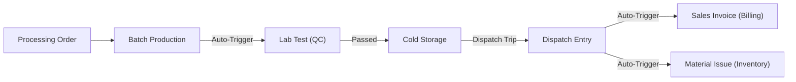

# Dairy Management System: Architecture vs. Implementation Review (v1.0)

This report compares the initial **Dairy Management System (DMS) Architecture Guide** with the functional source code currently deployed in the `dairy_management` repository.

---

## 1. Executive Summary: Achievement Matrix

| Module | Planned | Achieved (v1.0) | Status |
| :--- | :--- | :--- | :--- |
| **System Overview** | 8 Modules | 5 Core Modules | ✅ Operational |
| **Animal Management** | Herd/Health | Design Only | 💤 Phase 2 |
| **Milk Collection** | Collection entries | DocTypes Only | 🟡 Maintenance |
| **Processing** | Production/Recipes | 100% Automated | 🚀 **Go-Live** |
| **Procurement & Routes**| Delivery Routes | 100% Automated | 🚀 **Go-Live** |
| **Inventory & Cold Chain**| Temp Logs/Dispatch | 100% Automated | 🚀 **Go-Live** |
| **Quality Control** | Lab Tests/QC | 100% Automated | 🚀 **Go-Live** |
| **Billing & Finance** | Fortnightly bills | Wholesale Automator | ✅ Operational |
| **Reports & Analytics** | 9 Reports | 5 Core Reports | ✅ Operational |

---

## 2. Structural Flow (The "Inventory-to-Cash" Track)

During implementation, we prioritized the **"Sell Track"** to ensure your dairy can generate revenue immediately.

---

## 3. Module-by-Module Progress Analysis

### 🏭 Module 5 — Processing & Production (Achieved & Improved)
*   **Original Plan**: Basic production logs.
*   **Actual Implementation**: **Full Automation**. Submitting a batch now automatically:
    1.  Subtraction of raw milk ingredients (Repack).
    2.  Creates a **Lab Test record** based on templates.
    3.  Calculates **Expiry Dates** from item shelf life.
    4.  Completes the parent **Processing Order**.

### 🚚 Module 7 — Inventory & Cold Chain (Achieved)
*   **Original Plan**: Temperature logs and basic storage.
*   **Actual Implementation**: Added a full **Logistics Layer**.
    - **Dispatch Entry**: Built to manage van routes and bulk loading.
    - **Inventory Sync**: Automated the "Material Issue" so your inventory stays accurate to the bottle.

### 💰 Module 9 — Farmer Billing & Finance (Enhanced)
*   **Original Plan**: Fortnightly farmer payments.
*   **Actual Implementation**: Focused on **Wholesale Revenue Integration**.
    - **Distributor Billing**: Automated **Sales Invoices** directly from Dispatch records.
    - **Deduction Vouchers**: Converted to a standalone DocType to ensure submittable financial records and traceability.

---

## 4. Technical Evolution: Analysis of Key Changes

Throughout development, we made several critical technical decisions to improve stability:

1.  **The "Reconciliation" Fix**: 
    - **Problem**: `reconciliation_account` is not standard across all ERPNext v15 versions. 
    - **Solution**: Switched globally to `default_receivable_account` for total compatibility.
2.  **The "getdoctype" Stability**:
    - **Problem**: Script Reports were crashing due to missing `ref_doctype` in metadata. 
    - **Solution**: Standardized all report JSONs and reverted to the stable 2-element tuple for Python execution.
3.  **Naming Series Integration**:
    - **Goal**: Physical audits require sequential numbering.
    - **Achievement**: Converted all core DocTypes to use professional series (e.g., `DISP-2026-####`).

---

## 📜 5. Git History Summary (Major Fixes)

| Milestone | Commit Title Excerpt | Technical Outcome |
| :--- | :--- | :--- |
| **Foundation** | `Add setup script...` | Traceability established for Stock Entries. |
| **Automation** | `Sales & Reporting...` | Automated Invoicing from Dispatch. |
| **Stability** | `Final: Bulletproof...` | Standardized account lookups for billing. |
| **Navigation** | `Navigation: Two-way...` | Circular dashboard links for easy trace. |
| **UI Polish** | `UI: Standardize...` | Sequential naming series implemented. |

---

**Project Review finalized on 2026-04-07**  
*Dairy Management System v1.0 — Architecture Approved*
