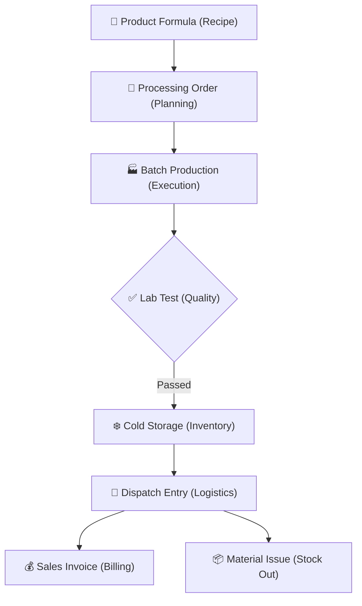

# Dairy Management System (DMS): Complete Project Summary

This document provides a full structural and technical overview of the **Dairy Management System (DMS)** built on Frappe/ERPNext. It details the end-to-end flow of operations and the key improvements made during development.

---

## 🏗️ 1. Structural Flow (The Lifecycle)

The system is designed for a seamless, automated journey from raw ingredients to distributor billing.

### 🥛 The "Make" Track (Processing)
*   **Product Formula**: Multi-ingredient recipe engine (e.g., Milk + Salt = Paneer). Supports "Repack" logic for automatic ingredient subtraction.
*   **Batch Production**: 
    - **QC Automation**: Submitting a batch automatically triggers a **Lab Test**.
    - **Expiry Engine**: Automatically calculates **Expiry Dates** based on item shelf life.
    - **Loop Closure**: Marking a batch as "Done" automatically completes the source **Processing Order**.

### 🚚 The "Move" Track (Inventory & Logistics)
*   **Cold Storage Log**: Monitors temperatures with automated safety fallback (4.0°C) to ensure product quality.
*   **Dispatch Entry**: 
    - **Route-Wise Loading**: Automates van loading for specific delivery routes.
    - **Stock Exit**: Automatically creates a **Material Issue** in ERPNext upon submission.
    - **Professional IDs**: Uses sequential naming (e.g., `DISP-2026-####`).

### 💵 The "Sell" Track (Billing)
*   **Automated Invoicing**: Optionally creates a **Draft Sales Invoice** for wholesale customers directly from the Dispatch trip.
*   **Deduction Vouchers**: Standalone submittable DocType for handling farmer or distributor deductions.

---

## 🛠️ 2. Core Technical Enhancements

### 🔍 Circular Traceability (Connections)
Every core document is interconnected via the **"Connections"** dashboard button:
- **Sales Invoice** ↔ **Dispatch Entry** ↔ **Batch Production** ↔ **Stock Entry**.
- This allows 1-click tracking from a customer's bill back to the raw milk and quality test.

### 📊 Business Intelligence (Reports)
- **Dispatch Summary**: Route-wise sales and quantity analysis for logistics optimization.
- **Processing Yield Report**: Detailed tracking of production efficiency.
- **Cold Chain Compliance**: Visual log of temperature safety across the warehouse.

### ⚙️ Automation & Robustness
- **Bulletproof Invoicing**: Integrated automated lookup for **Company**, **Debit Account**, and **Cost Center** to prevent ERPNext validation errors.
- **Safe Database Lookups**: Uses `frappe.get_meta().has_field()` and `frappe.get_cached_value` to ensure compatibility across different ERPNext v15 versions.

---

## 📜 3. Major Development Milestones

| Feature | Description | Status |
| :--- | :--- | :--- |
| **New DocType System** | Built Processing Order, Batch Production, Dispatch Entry, and Deduction Voucher. | ✅ Completed |
| **Recipe Engine** | Implemented multi-ingredient "Repack" automation. | ✅ Completed |
| **Sales Bridge** | Automated Draft Sales Invoice creation from Dispatch entries. | ✅ Completed |
| **QC Lock** | Integrated Lab Test status checks for production batches. | ✅ Completed |
| **UI/UX Polish** | Implemented Two-Way Dashboard Connections and Sequential Naming Series. | ✅ Completed |

---

## 🚀 4. Final Deployment Instructions

To ensure all new fields, reports, and connections are active on your server:

1.  **Pull Latest Code**: `git pull origin main`
2.  **Schema Update**: `bench --site [SITE_NAME] migrate`
3.  **Field Registration**: `bench --site [SITE_NAME] execute dairy_management.setup.setup_custom_fields.execute`
4.  **Dashboard Refresh**: `bench --site [SITE_NAME] execute dairy_management.setup.setup_workspace.execute`
5.  **Hard Restart**: `bench restart`

---

**Generated by Antigravity AI**  
*Project finalized on 2026-04-07*
